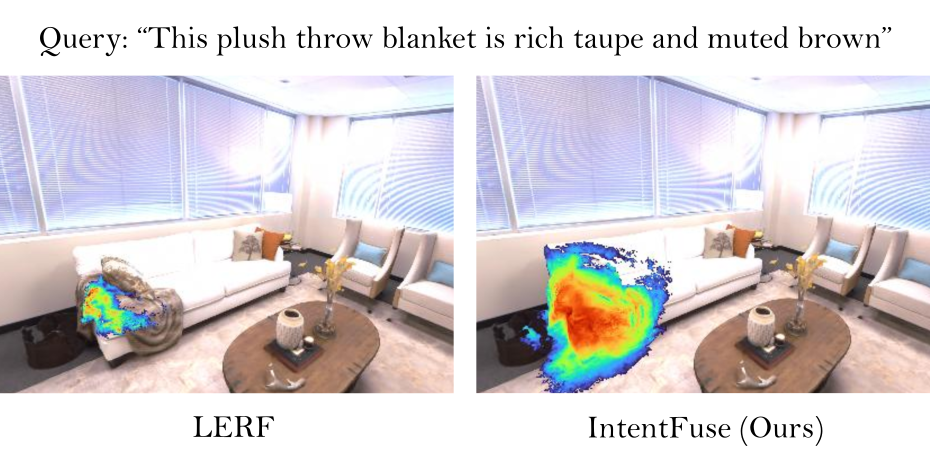

<h1 align="center">IntentFuse: Language-Guided 3D Scene Understanding via Prompt Filtering and Fusion</h1>

<p align="center">
  <a href="https://people.csiro.au/r/a/ahalya-ravendran">Ahalya Ravendran</a>, 
  <a href="https://people.csiro.au/p/m/madhawa-perera">Madhawa Perera</a>, 
  <a href="https://ieeexplore.ieee.org/author/315963702412879">Feng Xu</a>, 
  <a href="https://people.csiro.au/P/L/Lars-Petersson">Lars Petersson</a>, 
  <a href="https://people.csiro.au/W/D/Dadong-Wang">Dadong Wang</a>, 
  <a href="https://people.csiro.au/L/X/Xun-Li">Xun Li</a>
</p>

<p align="center">
  <a href="https://ieeexplore.ieee.org/xpl/conhome/1001512/all-proceedings">Paper</a> |
  <a href="https://collaborative-work-space.github.io/intentfuse/">Project Page</a>
</p>

<p align="center">
  
</p>

## 📌 Overview
**IntentFuse** is a lightweight middleware that grounds natural language queries in 3D scenes by connecting a compact language model with a pretrained LERF. It reformulates free-form queries into structured prompts, handling affordances and negations without extra training. Experiments show clear gains over LERF, enabling intuitive affordance grounding for robotics and AR/VR exploration.

## ⚙️ Environment Setup
Our code is implemented as a **middleware on top of [LERF](https://github.com/kerrj/lerf)**, which itself is built on [Nerfstudio](https://docs.nerf.studio/).  
This setup ensures that **IntentFuse works seamlessly with any CLIP-based querying framework**.

### 1. Install Nerfstudio
Follow the official [Nerfstudio installation guide](https://docs.nerf.studio/quickstart/installation.html).  
We recommend creating a fresh conda environment as described in their instructions.

### 2. Install LERF
Clone and install [LERF](https://github.com/kerrj/lerf):
```bash
git clone https://github.com/kerrj/lerf.git
cd lerf
pip install -e .
```

### 3. Additional Python Packages

In addition, install the following packages required by IntentFuse:
```bash
pip install transformers graphviz
```
### 4. Install IntentFuse

Our code is located in the **`src/` folder** of this repository.  
These scripts extend LERF by adding **query restructuring, context-aware filtering, and intent fusion**.

### 5. Verify Installation

Once Nerfstudio and LERF are installed, the modules in `src/` can be directly used with your LERF experiments.  
For example:
```bash
python src/run_intentfuse.py --config configs/example.yaml --output-dir /results  --smart-prompt "something to put flowers in"
```

## 📂 Repository Structure

```text
intentfuse/
│── src/                 # Our middleware code (Query Evaluator, Context Provider, etc.)
│── images/              # Project images and GIFs for the website
│── css/                 # Stylesheets for project website
│── js/                  # Scripts for project website
│── index.html           # Project website main page
└── README.md            # This file


## 📖 Citation

If you found this code/work to be useful in your own research, please consider citing the following:

```bibtex
@article{ravendran2025intentfuse,
  title={IntentFuse: Language-Guided 3D Scene Understanding via Prompt Filtering and Fusion},
  author={Ravendran, Ahalya and Perera, Madhawa and Xu, Feng and Petersson, Lars and Wang, Dadong and Li, Xun},
  journal={International Conference on Digital Image Computing: Techniques and Applications},
  year={2025}
}
